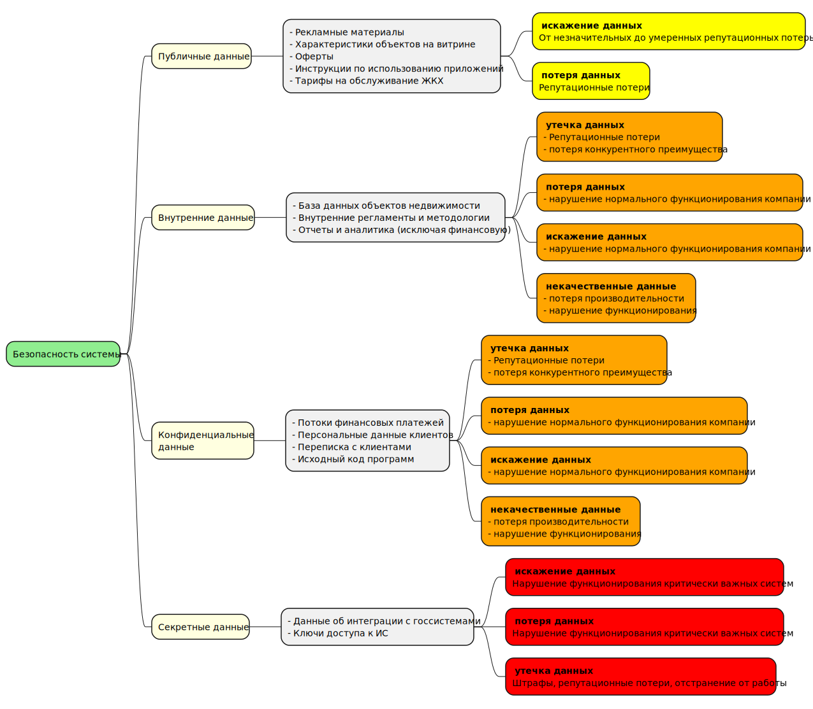

## Задание 1. Разработка проверочного листа по безопасности данных

1. Классификация данных:  

    Публичные данные:
  
   - Общая информация о компании: описание компании, юридические реквизиты, виды услуг.
   - Маркетинговые материалы: акции, объявления.
   - Информация о жилых комплексах (общие описания, фотографии, планы).
   - Данные онлайн-витрины недвижимости:  переченьобъектов, цены и базовые характеристики.
   - Объявления о плановых и выполняемых ремонтах, опубликованные для собственников.
   - FAQ и инструкции по пользованию приложениями  исервисами.  
   
    Внутренние данные:
    
   - Внутренние бизнес-процессы, регламенты и методологии.
   - База данных объектов недвижимости без персональных данных.
   - Результаты осмотров недвижимости (без персональных меток).
   - Логические схемы архитектуры IT-сервисов и доменной структуры (не содержащие конфиденциальной информации).
   - Внутренние отчёты и аналитика по работе сервисов без персональных и финансовых данных.
   - Контент внутри операционной команды, не затрагивающий чувствительные данные.
   - Статистическая информация по бронированиям без персональных данных.

    Конфиденциальные данные:

    - Персональные данные клиентов и собственников (ФИО, контакты, адреса мест жительства)
    - Данные сделок по покупке недвижимости, включая договоры и платежные документы.
    - Информация из CRM систем (клиенты и собственники).
    - Данные платежей ЖКХ и истории операций в мобильном приложении для собственников.
    - Отчёты и аналитика с персональными идентификаторами.
    - Интеграция с госорганами и данные, передаваемые в рамках онлайн-сделок.
    - Резервные копии баз данных с персональными и финансовыми данными.
    - Логирование событий, содержащих сведения о клиентах и собственниках.

    Секретные данные:

    - стратегические планы развития
    - Коммерческая тайна: условия контрактов, договоров с партнёрами и подрядчиками.
    - Криптографические ключи, сертификаты, данные для доступа к системам (root-доступ, ключи шифрования).
    - Техническая архитектура безопасности, детали сетевой инфраструктуры, настройки firewall.
    - Результаты аудитов информационной безопасности и выявленные уязвимости.
    - Учетные данные администраторов и DevOps-инженеров.
    - Логины и пароли к критическим системам и облачным ресурсам.
    - Внутренние документы по расследованиям инцидентов ИБ.
    - Данные о сотрудниках ИБ и управленческая информация, связанная с безопасностью.

1. Mindmap
  